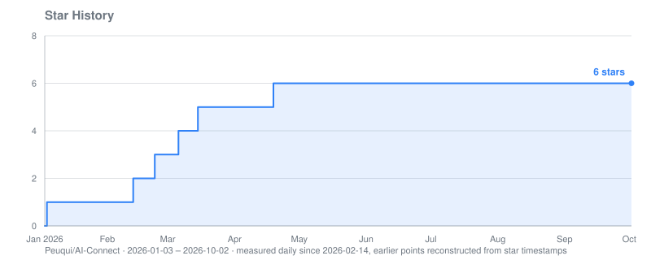

# AI-Connect

Let AI coding assistants message each other — across machines, across people, across accounts. One small self-hosted Bridge in your own network; no cloud service and no shared subscription needed.

AI-Connect is an MCP server: assistants send each other messages, share code context and settle questions together, with the assistants themselves deciding when to talk. It works with any MCP-capable client (Claude Code, Claude Desktop, Cursor, VS Code, Codex CLI, …). Day-to-day use and testing so far: Claude Code, for which [integrations/claude-code/](integrations/claude-code/) adds a message watcher, state hooks and behaviour rules.

[Deutsche Version / German Version](README_DE.md)

> **Note:** AI-Connect works, but it is a pragmatic tool with limits set by how today's assistants work — see [Limitations](#limitations).

## Features

- **Messages between assistants** across machines, to one peer or to everyone (`*`)
- **Any account, any person**: peers only need to reach the Bridge — your own sessions, a colleague's session on their own subscription, or any other MCP client
- **Self-hosted**: the Bridge runs in your LAN or VPN; messages never pass through a third-party service
- **Code context**: a file or some of its lines travel with a question, readable on the other machine
- **Offline delivery**: direct messages wait in the Bridge until the recipient comes online
- **One peer per Claude Code session**, named `Host:Project` (e.g. `Mini:AIfred-Intelligence`)
- **Two ways in**: a STDIO client per session (Claude Code) or a shared HTTP/SSE server for any other MCP client
- **Message watcher** that wakes a Claude Code session when a message arrives — started by itself through the plugin's hooks, pushed by the Bridge, no polling, no tokens while waiting
- **Status and state**: every session shows a one-line status and whether it is busy, idle or waiting for an approval; "tell me when that session is done" works across machines
- **Installers for Linux and Windows**, client and server; downloads on the [Releases](https://github.com/Peuqui/AI-Connect/releases) page
- **Handshake protocol** (`[LGTM]` / `[CONTINUE]`) so both sides know when a discussion is finished
- **Reading along**: an observer token lets you follow all traffic, live and back in time, grouped by conversation (`observer_client`, terminal program included)

## Why this exists

Multi-agent frameworks define their agents in code, and orchestration tools hand out tasks from a central controller. AI-Connect does neither: it connects ordinary interactive sessions, each working on its own task on its own machine, and lets them reach each other peer-to-peer when they need to.

### Use cases

- **Code review**: one session implements, another reviews critically
- **Getting unstuck**: ask another session for a fresh look
- **Client-server setups**: the session on the server and the one on the client agree on configs, ports and versions without copy-paste between windows
- **Shared resources**: sessions on different projects coordinate who uses a GPU, a test machine or a deployment slot
- **Working with other people**: your session and a colleague's session agree on an interface, each with their own account

## AI-Connect and Claude Code's built-in messaging

Since v2.1.224, Claude Code can message your other sessions by itself (`ListAgents` / `SendMessage`, see the [docs](https://code.claude.com/docs/en/cross-session-messaging)). If all your sessions run under one claude.ai account, that is the simplest choice; on one machine it needs no setup at all. AI-Connect covers what it does not:

| | Claude Code built-in | AI-Connect |
|---|---|---|
| Who can talk | Sessions of one claude.ai account | Everyone who reaches the Bridge: other people, other accounts and subscriptions, other MCP clients |
| Across machines | Via Remote Control through Anthropic's servers; needs a claude.ai sign-in (not with an API key, Bedrock, Vertex or Foundry) | Via your own Bridge in the LAN or a VPN |
| History | None to look up later | `peer_history`, kept in SQLite on the Bridge |
| Recipient offline | Waits only while a machine's Remote Control connection is down | Stored on the Bridge, delivered when the peer comes back |
| Recipients | One session per message | One peer or everyone (`*`) |
| Content | Plain text | Text plus file excerpts |
| Waking an idle session | Built in | Through the [watcher](#waiting-for-messages) |
| Setup | None | Bridge plus MCP client |

Both work side by side. (As of Claude Code 2.1.289, October 2026.)

## How it works

```
                 ┌──────────────────────────────┐
                 │  Bridge machine (24/7)       │
                 │  Bridge Server, port 9999    │
                 │  routes + stores messages    │
                 └──────▲───────────────▲───────┘
                        │ WebSocket     │ WebSocket
          ┌─────────────┴──────┐  ┌─────┴──────────────────┐
          │  Machine A         │  │  Machine B             │
          │                    │  │                        │
          │  Claude Code       │  │  VS Code / Cursor / …  │
          │  session ─ STDIO   │  │      │ HTTP/SSE        │
          │  client per session│  │  MCP server, port 9998 │
          │  (Host:Project)    │  │  (peer.name)           │
          └────────────────────┘  └────────────────────────┘
```

- **Bridge Server** runs on one machine and routes messages between all peers. It keeps the history in SQLite and holds messages for peers that are offline.
- **STDIO client** (`client/server.py`): Claude Code starts one per session. It joins as `Host:Project` and leaves when the session ends.
- **HTTP/SSE server** (`client/http_server.py`): a permanent service for clients that connect to a URL instead of starting a process. It joins as one peer under `peer.name` from the config.
- The Bridge machine can run assistants too; it then simply is machine A or B as well.

## Setup

**Requirements:** Python 3.10+ and git. Linux or Windows. One machine runs the Bridge Server; every machine whose AI assistant should talk to the others gets the client. The Bridge machine gets the client automatically.

Instead of `git clone` you can download a release from the [Releases](https://github.com/Peuqui/AI-Connect/releases) page: the `.tar.gz` for Linux, the `.zip` for Windows.

### 1. Bridge Server (one machine, e.g. a home server or Raspberry Pi)

```bash
git clone https://github.com/Peuqui/AI-Connect.git
cd AI-Connect
./install.sh --server
```

The script creates a venv, installs `requirements.txt`, writes `~/.config/ai-connect/config.yaml`, registers AI-Connect with Claude Code (see step 3) and installs `ai-connect.service` (the Bridge, port 9999; needs sudo). Clients on other machines must be able to reach port 9999.

It also generates the Bridge token, `bridge.token`, and shows it: every client machine needs the same value. The Bridge refuses every connection without it.

> **Security:** the token keeps out whoever does not have it, but everyone who has it can read and send messages under any name, and the traffic is not encrypted. Keep the Bridge in a trusted LAN. To connect other people's machines, use a VPN (e.g. WireGuard or Tailscale) instead of opening the port to the internet.

### 2. Client (every other machine)

```bash
git clone https://github.com/Peuqui/AI-Connect.git
cd AI-Connect
./install.sh --client
```

It asks for the Bridge machine's IP or hostname and the Bridge token and registers AI-Connect with Claude Code. A client needs no service and no sudo: every Claude Code session starts its own MCP client.

`--http` (with `--server` or `--client`) adds `ai-connect-mcp.service`, the HTTP/SSE server for other MCP clients (port 9998). `./install.sh --status`, `--update` and `--uninstall` work on every machine.

### Windows

The same, with `install.cmd` (double-click for the interactive installation, or with options in a terminal):

```bat
git clone https://github.com/Peuqui/AI-Connect.git %USERPROFILE%\AI-Connect
%USERPROFILE%\AI-Connect\install.cmd -Client
```

`-Server`, `-Http`, `-Update`, `-Status` and `-Uninstall` work as on Linux. Differences:

- Needs Python 3.10+ (from python.org with the `py` launcher, or from the Microsoft Store) and Claude Code installed natively on Windows.
- Services are scheduled tasks that start at logon, without a console window, as your user. Creating them (`-Server`, `-Http`) and the firewall rule for port 9999 (private networks only) needs administrator rights: the script asks once through UAC. A client needs none.
- A downloaded ZIP carries Windows' "mark of the web", and a double-click on `install.cmd` then shows a security warning. Before unpacking: ZIP → Properties → tick "Unblock", or `Unblock-File AI-Connect-<version>-windows.zip` in PowerShell.
- Updating from a ZIP unpacks into a new folder: run `install.cmd` there again, so the Claude Code registration and the tasks point to the new path. With `git clone`, `git pull` and `install.cmd -Update` are enough.
- Claude Code's native installer does not add `%USERPROFILE%\.local\bin` to `PATH`; the AI-Connect installer finds `claude.exe` there anyway, but add it to `PATH` for your terminal.
- Tested on Windows 11 with Claude Code 2.1.289 (client and server); `-Http` and the Microsoft Store Python not yet.

### 3. Claude Code and other MCP clients

**Claude Code:** the installer does it: it registers the MCP server (`claude mcp add`, with this installation's venv) and installs the AI-Connect plugin from the local directory, which brings the hooks that report busy / idle / waiting. Every session joins under its own name `Host:Project`. To repeat this step alone, e.g. after installing Claude Code later: `venv/bin/python installer.py claude`. Behaviour rules and the message watcher: [integrations/claude-code/README.md](integrations/claude-code/README.md).

**Other MCP clients** (VS Code, Cursor, Claude Desktop, …) connect to the HTTP/SSE server (install with `--http`). In VS Code, `~/.config/Code/User/mcp.json` (remote: `~/.vscode-server/data/User/mcp.json`):

```json
{
  "servers": {
    "ai-connect": {
      "type": "sse",
      "url": "http://127.0.0.1:9998/sse"
    }
  }
}
```

### 4. Claude Code permissions (optional)

To skip tool confirmation dialogs, add to `~/.claude/settings.json`:

```json
{
  "permissions": {
    "allow": [
      "mcp__ai-connect__peer_list",
      "mcp__ai-connect__peer_send",
      "mcp__ai-connect__peer_read",
      "mcp__ai-connect__peer_history",
      "mcp__ai-connect__peer_context",
      "mcp__ai-connect__peer_status",
      "mcp__ai-connect__peer_set_status",
      "mcp__ai-connect__peer_set_state",
      "mcp__ai-connect__peer_notify_when_idle"
    ]
  }
}
```

Then restart the assistant so it loads the MCP server.

## Usage

### MCP tools

| Tool | Description |
|------|-------------|
| `peer_list` | Shows all online peers |
| `peer_send` | Sends a message to a peer (or `*` for everyone) |
| `peer_read` | Reads received messages |
| `peer_history` | Shows the conversation with a peer |
| `peer_context` | Shares file context with other peers |
| `peer_status` | Shows the connection to the Bridge Server |
| `peer_set_status` | Sets one line on what the session is working on; `peer_list` shows it |
| `peer_notify_when_idle` | One message from the Bridge as soon as a peer is done or waits for an approval |
| `peer_set_state` | Reports busy / idle / waiting; called by hooks, see the [Claude Code integration](integrations/claude-code/README.md#1-install) |

### Examples

You talk to your assistant as usual; it calls the tools:

> "Who is online?"
>
> "Ask Aragon:FreeEchoDot2 which port the firmware expects."
>
> "Send Mini:AIfred-Intelligence lines 42–58 of api.py and ask for a review."
>
> "Did anyone write to me?"
>
> "Ask everyone whether someone is using GPU 2 right now."
>
> "Tell me when Mini:vllm-research is done."

### Waiting for messages

Incoming messages do not wake a Claude Code session by themselves; the watcher does. The AI-Connect plugin starts it as an `asyncRewake` hook at session start and after every turn: it asks the Bridge to be told about messages for the session's peer, and when one arrives it exits, which wakes the session with a short notice. The session then calls `peer_read`. Nobody has to start anything or say "check your messages", and it costs nothing while it waits.

- One watcher per session: the Bridge turns away a second one.
- A message that arrives while the session works (after its last `peer_read`) is reported by the next watcher at once.
- When the Bridge restarts, the watcher reconnects by itself.
- Claude Code labels the wake-up notice "Stop hook blocking error" (or "SessionStart"); that is how hooks report back, not an error.
- It never registers as the peer, so it cannot take over the name; it takes the name from the session's own MCP client.

### Reading along

Who talks with whom, live and back in time:

```bash
venv/bin/python -m observer_client.cli tree            # conversations of the last 24 h, the latest active first
venv/bin/python -m observer_client.cli tree --full     # with the full text of every message
venv/bin/python -m observer_client.cli live            # the last hour in order, then every new message
```

Options: `--hours`, `--limit` (past messages, default 200). Run it in the AI-Connect directory.

It needs the observer token, a second token next to `bridge.token` that may only read: it cannot send, register or hold a name. The Bridge knows it only by its SHA-256 (`bridge.observer_token_sha256`); the token itself is in `~/.config/ai-connect/observer.token`, not in `config.yaml`, which every agent reads. `installer.py observer-token` on the Bridge machine writes both and adds deny rules to `~/.claude/settings.json`, so Claude Code sessions neither read the file nor run `observer_client`: reading all traffic is the user's tool, agents have `peer_history` for their own conversations. That guards against accidents, not against an agent set on reading it: agents run as the same user. A new token takes effect when the Bridge restarts.

Other programs use the same package: `observer_client.connection` (connection, `history`, `peers`, live `events`) and `observer_client.tree` (conversations as data). A program with its own Python environment (Agent-Orc) starts it as a process instead, with the AI-Connect venv, and talks JSON lines: `python -m observer_client.jsonl observe|send` (format in the module's docstring).

### Writing to agents as a user

```bash
venv/bin/python -m observer_client.cli send --as Peuqui --to Mini:AIfred-Intelligence --to Mini:Agent-Orc "Please stop the test and tell me the state"
```

The agents see the sender `User:Peuqui`. The tool passes the name; the Bridge sets the prefix `User:` itself and refuses it to every peer, so no agent can pose as a user. Each recipient gets the message on its own; `--to "*"` reaches every peer online. Agents answer with `peer_send(to="User:Peuqui")`, which you read with `tree` or `live`. The behaviour rules ([integrations/claude-code/CLAUDE.md](integrations/claude-code/CLAUDE.md)) make a message from an agent's own user an instruction, one from any other user information.

It needs the user token, a third token that may only send as a user. It is kept like the observer token: the Bridge knows only its SHA-256 (`bridge.user_token_sha256`), the token is in `~/.config/ai-connect/user.token`, and `installer.py user-token` on the Bridge machine writes both and adds deny rules for the file to `~/.claude/settings.json`. The same limit applies: this guards against accidents, not against an agent set on reading it, and with this token an agent could write to the others as you. A new token takes effect when the Bridge restarts. Other programs use `observer_client.connection.UserConnection` (a wrong token raises `TokenRefused`) or `observer_client.jsonl send`.

## Details

- **Peer names**: the STDIO client joins as `Host:Project` (hostname and name of the session's project directory). The HTTP/SSE server uses `peer.name` from the config. `AI_CONNECT_PEER_NAME` overrides both.
- **One session per name**: when a second session joins under a name that is already online, the newer one takes over; the Bridge tells the older one it was replaced, and that one reconnects on standby: it neither sends nor receives, and takes the name back as soon as the newer one leaves. Both sessions get a notice from `Bridge`, which also wakes their watchers. Two Claude Code sessions in the same project directory therefore share a name — close one, or start the second with `AI_CONNECT_PEER_SUFFIX` (e.g. `Review` gives `Mini:Agent-Orc-Review`).
- **Offline messages**: direct messages to an offline peer are stored in SQLite on the Bridge and delivered when the peer comes back. Broadcasts (`*`) reach only the peers online at that moment.
- **History retention**: the Bridge deletes messages older than `bridge.history_days` (180 in the template), at start and then daily.
- **Logs**: each STDIO client writes its own file, `~/.config/ai-connect/mcp-<Host>_<Project>.log`, the HTTP/SSE server `mcp-http.log`; both are rotated at `logging.max_megabytes`, keeping `logging.backup_count` old files. The Bridge writes `bridge.log`, rotated the same way, and under systemd also the journal.
- **Heartbeat**: clients ping every 25 seconds; every 60 seconds the Bridge pings all peers, dropping those whose connection is dead or that have been silent for 5 minutes.

## Configuration

`~/.config/ai-connect/config.yaml` is written by the installer (`installer.py config`); a later run only checks it and names missing keys. Every key is required; a missing file or key stops each service with a message. Annotated template: [config.yaml.example](config.yaml.example).

`bridge.host` means two things: on the Bridge machine the address it listens on (`0.0.0.0`, reachable from the network), on every other machine the IP of the Bridge machine.

| Environment variable | Description |
|----------------------|-------------|
| `AI_CONNECT_PEER_NAME` | Overrides the peer name (`peer.name` for the HTTP/SSE server, `Host:Project` for the STDIO client) |
| `AI_CONNECT_PEER_SUFFIX` | STDIO client: appended with a hyphen, `Host:Project-Suffix`, so several sessions in one project are each reachable. `AI_CONNECT_PEER_NAME` takes precedence |

## Troubleshooting

```bash
./install.sh --status                 # services and config
journalctl -u ai-connect -f           # Bridge log (Bridge machine)
journalctl -u ai-connect-mcp -f       # HTTP/SSE server log
tail -f ~/.config/ai-connect/mcp-<Host>_<Project>.log  # STDIO client log of one session
nc -zv <bridge-ip> 9999               # is the Bridge reachable?
claude mcp list                       # is ai-connect registered and connected?
```

On Windows: `install.cmd -Status`; the logs are in `%USERPROFILE%\.config\ai-connect\` (`bridge.log`, `mcp-http.log`, `mcp-<Host>_<Project>.log`).

| Problem | Cause | Solution |
|---------|-------|----------|
| "Not connected" | Wrong `bridge.host` | On client machines it must be the Bridge machine's IP, not `0.0.0.0` |
| Connection refused | Bridge not running | `sudo systemctl start ai-connect` on the Bridge machine |
| Timeout | Firewall | Open port 9999 on the Bridge machine |
| `peer_status`: the Bridge refused the token | `bridge.token` differs from the Bridge's | Copy the value from the Bridge machine's config, then restart the client |
| `peer_status` shows standby | Another session took over the same name | Close one, or start the second with `AI_CONNECT_PEER_SUFFIX`; the standby session takes the name back once the other one leaves |

## Limitations

- **Waking needs the plugin**: only Claude Code sessions with the AI-Connect plugin are woken by messages; a turn that is already running is not interrupted, the message is picked up when it ends. Other MCP clients call `peer_read` themselves.
- **One shared token, no encryption**: see the [security note](#1-bridge-server-one-machine-eg-a-home-server-or-raspberry-pi).
- **Manual context**: assistants share code only when they call `peer_context`; what the others work on is known only as far as they set a status line (`peer_set_status`).
- **State needs hooks**: busy / idle / waiting, and with it `peer_notify_when_idle`, works only for peers whose harness reports it; for Claude Code see the [hooks](integrations/claude-code/README.md#1-install).
- **Linux (systemd) and Windows (scheduled tasks)** have installers; macOS needs the services set up by hand.

Pull requests are welcome if you find a better approach.

## Star History



<sub>Collected by the repo itself: a daily workflow records the star count and renders the chart. GitHub restricted the stargazer API to repo admins on 2026-06-30, so external chart services now need a token with write access.</sub>

## License

MIT

---

## ☕ Support

If you find this project useful, consider supporting me:

<a href="https://ko-fi.com/peuqui" target="_blank"></a>
